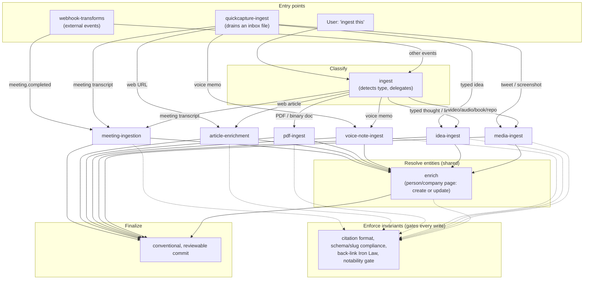

# Modeling Ingestion in a Knowledge-Base Agent

Raw material arrives in every shape: a meeting transcript, a web article, a
PDF, a tweet, a voice memo, a webhook payload from a call-recording service.
Each shape needs different extraction logic — you don't parse a PDF the way
you parse a diarized transcript. But every shape has to converge on the same
durable representation: a note, a set of entities it touches, the citations
that back it, and the links that connect it to what's already there. A single
ingest function that starts simple ("if it's a URL, fetch it; if it's a file,
read it") accretes an `if kind == ...` ladder as source types grow, and the
ladder is where ingestion pipelines rot — each new type adds a branch, each
branch half-duplicates the branch before it, and the parts that should be
shared (how do we find the person this mentions? how do we cite the source?)
get reimplemented slightly differently in each one.

This paper works from a concrete example of an ingestion pipeline organized to
avoid that — a GBrain-based personal knowledge vault whose ingestion is split
across a dozen cooperating "skills" — extracts the general pattern underneath
the specific implementation, and closes with a proposal for wakil's own
`ingest_service.py`.

The central claim: ingestion is not one process, it's four separable
concerns plus a finalize step — **classify** the input, **extract**
type-specific structure from it, **resolve entities** against what the
knowledge base already knows (this part is the same regardless of source
type), and **enforce invariants** that every write must satisfy no matter
which path produced it. Conflating these is what makes ingestion code
brittle. Keeping them separate — as functions, as modules, as whatever your
language's unit of separation is — is what the worked example gets right,
independent of the fact that its implementation happens to be a swarm of
LLM-invoked markdown files.

## A worked example: GBrain's skill-organized ingestion

The vault in question routes all incoming content through a layered set of
`.hermes/skills/` procedures (thin `.claude/skills/` wrappers just point at
the same files — the organization lives entirely on one side).

Two entry points feed the pipeline: a webhook transform that normalizes
external events (a completed call recording, an inbound SMS), and an inbox
drain (`quickcapture-ingest`) that classifies whatever a phone's share-sheet
dropped into a scratch file. Both, along with a direct user request, funnel
into a **router** (`ingest`) whose only job is to look at the input and
delegate — it does no extraction itself. Six **type-specific skills** do the
actual work: a meeting transcript becomes a synthesized page with attendee
propagation; a web article becomes a structured page with an executive
summary and verbatim quotes; a PDF gets text-extracted and routed by what the
extracted content turns out to be (email thread, resume, contract); a voice
memo is transcribed with the user's exact phrasing preserved; a typed idea or
shared link gets an author page and an analysis; a video/audio/book/screenshot
goes through format-specific extraction and then the same downstream steps as
everything else.

Every one of those six skills, regardless of what it started from, ends the
same way: it hands off every person and company it touched to one **shared
entity-resolution step** (`enrich`) that checks whether a page already
exists, updates it if so, creates it if not (after a notability check — not
every mentioned name deserves a page), and writes the timeline entry. This
is deliberate and load-bearing. The skill documentation says it plainly: "a
meeting is NOT fully ingested until enrich runs for every entity" — because
entity propagation is the step every naive ingestion pipeline skips, and the
way to stop skipping it is to make it one shared step that every path is
required to call, rather than logic re-embedded in each type-specific skill.

Underneath all of that sits a **shared invariants layer** that isn't a
step in the pipeline so much as a set of gates every write passes through: an
inline citation on every fact, a bidirectional back-link for every entity
mention (called the "Iron Law" in the source material — an unlinked mention
is treated as a bug), frontmatter/slug schema compliance, and the notability
gate mentioned above. None of the six type-specific skills reimplement these
checks; they're referenced, not duplicated.

Finally, everything **finalizes** through a single conventional-commit step,
and a separate, lower-frequency **maintenance** pass (backlink repair, stale
page detection) runs adjacent to — not inside — the ingestion hot path.

Two specific tricks are worth lifting out on their own, because they're
useful independent of anything else in this document:

**Land raw, enrich second.** Content that needs interpretation (a tweet, a
diarized transcript) is always written as a verbatim, unedited record first,
and only then synthesized into an understood page that cites back to the raw
one. This decouples "did we capture this" from "did we understand this
correctly" — capture never blocks on model quality, and a bad synthesis pass
can be redone from the raw record without re-fetching anything.

**A shared entity step exists because duplication is where these systems
rot.** The failure mode isn't "we forgot to link an entity once." It's "we
implemented entity-linking six times, slightly differently, and five of the
six versions silently degrade over time because nobody maintains code paths
that duplicate a concern that should have been factored out once."

It's worth naming plainly what this *is*: a prompt/agent-organized
implementation, where each "skill" is a markdown procedure an LLM agent reads
and follows, and "delegation" means one agent invoking another. That's an
implementation choice suited to a system built as a constellation of Claude
Code skills. It is not the essence of the pattern — the same four-plus-one
separation of concerns applies just as well to a single compiled program with
no agents in it at all, which is the point of the next two sections.

## The general pattern, extracted

Strip the LLM-agent implementation away and what's left is architecture-
agnostic:

- **Classify** — decide what kind of thing the input is. Can be explicit
  (the caller states it) or inferred (a router looks at content shape).
- **Extract** — type-specific: turn raw bytes into text, title, origin
  metadata, and (usually via a model) a summary and structured claims.
  Different for every kind; this is where variation is supposed to live.
- **Resolve entities** — shared and type-agnostic: given the people/
  companies/concepts a piece of content touched, find-or-create the durable
  record for each, cited and linked. This step does not care what kind of
  source produced the mention.
- **Enforce invariants** — shared, and it gates writes rather than
  producing them: dedup, citation presence, path/schema validity, a
  notability check before creating something new. Every write passes
  through the same gate regardless of which extraction path produced it.
- **Finalize** — commit the result somewhere reviewable. Optionally,
  **adjacent maintenance** (repair, backfill, re-synthesis) runs as its own
  separate, lower-frequency lifecycle — never folded into the hot ingest
  path, because it has different triggers and different cost.

These are concerns, not mandated processes. The worked example gives each one
an LLM-invoked markdown file and an agent hand-off. A compiled implementation
gets the identical separation-of-concerns benefit — new source types don't
touch entity resolution, entity-resolution bugs get fixed in one place, every
write obeys the same invariants — from ordinary functions and modules. No
agent framework required to get the benefit; the benefit comes from not
conflating the five concerns, not from how each one is executed.

## Where this meets wakil's principles

One thing needs to be said directly: the worked example's *mechanism* — a
router agent inferring content type and dispatching to other agents, each
reading its own markdown procedure — is exactly the kind of thing wakil's
`CLAUDE.md` rules out. It names "large agent frameworks," "multi-agent
orchestration," and "overly abstract plugin architectures" as things to
avoid, and prefers "explicit commands" and "small composable services" to
inferred routing. Importing GBrain's mechanism wholesale would violate
several of wakil's stated design biases at once.

But the *decomposition* — classify / extract / resolve entities / enforce
invariants / finalize — doesn't depend on the mechanism, and wakil already
has three of the five pieces, by accident rather than by design:

- `prepare_ingest` / `apply_ingest`
  (`src/wakil/app/ingest_service.py`) is already the extract-then-review-gate
  shape: nothing is written until the human confirms the preview. This is
  the extract concern plus a review gate, correctly scoped, and it should not
  change.
- `RAW_DIRS`, the `kind`-keyed dict, and the `if kind in (...)` branch at the
  top of `prepare_ingest` are a thin classify step — thin because
  classification is a CLI argument the user supplies (`wakil ingest
  transcript ...`), not inferred from content.
- `_enrich_with_model` is a shared, type-agnostic extraction/entity step: one
  prompt, called once regardless of `kind`, that produces the summary, key
  points, candidate memories, candidate relationships, and proposed note.

The risk isn't the current three source kinds (`transcript`, `article`,
`text`). It's what happens on kind four, five, and six — PDFs, tweets, a
webhook-driven capture path, an `.srt`-adjacent video/audio transcript. Two
things grow unbounded if nothing changes: the `if/elif` ladder inside
`prepare_ingest`, and the single shared prompt in `build_ingest_prompt`,
which will have to learn every new kind's extraction quirks in one place.
That's the exact monolith-accretion failure the worked example's per-type
skill files exist to avoid — just arriving in Python instead of markdown.

## Proposal: a concrete model for wakil

Keep what's already correctly scoped, split what's about to accrete, and
don't import machinery wakil doesn't need.

**Keep `prepare_ingest` / `apply_ingest` as-is.** The two-phase
extract-then-review-gate shape is the right shape. Nothing here should
change.

**Split the `kind` branch into per-kind extractors.** Today `prepare_ingest`
holds an `if kind in ("transcript", "text"): ... elif kind == "article":
...` ladder, and `RAW_DIRS` is a parallel dict keyed the same way. As kinds
are added (PDF, tweet, webhook capture), pull each branch out into its own
small function behind one shared interface — something like `def
extract(source) -> RawSource` returning text, title, and origin — one module
per kind (e.g. `wakil/app/extractors/{transcript,article,text,pdf,tweet}.py`).
This is the Python-native analogue of the worked example's per-type skill
file: a new kind means adding one new module, not lengthening a shared
branch. `RAW_DIRS` collapses into a constant each extractor owns instead of a
dict every kind has to register into centrally.

**Keep `_enrich_with_model` as the one shared step every kind funnels
into.** This is wakil's analogue of the worked example's `enrich` — a single
place where "find or create the entities and candidate memories this content
touches" happens, regardless of what produced the text. Do not split this
per-kind. The value of a shared entity-resolution step is precisely that
it's shared; giving each kind its own enrichment prompt variant reintroduces
the duplication that a shared `enrich` step exists to prevent.

**Leave classification as an explicit CLI argument.** `wakil ingest
transcript ./raw/meeting.txt` is already better suited to wakil's stated
bias than the worked example's infer-from-content router — "explicit
commands" beats "hidden inference" per `CLAUDE.md`. Don't build a classifier.
This is a place where wakil's current design is already the right call
relative to the worked example, not a gap to close.

**Name the existing invariants, and add the one that's missing.**
`ingest_service.py` already enforces content-hash dedup
(`content_hash` lookup against `Source`), refuses to overwrite an existing
file (`apply_ingest`'s `target.exists()` check), and sandboxes proposed note
paths inside the workspace (`_sanitize_note`). What's missing is the worked
example's notability gate: a check, before proposing a *new* note file
(as opposed to just a candidate memory on an entity that already has a page),
of whether this content actually warrants its own file. Add one explicit
`validate_proposal()` step between `prepare_ingest` and `apply_ingest` that
groups these checks in one place, so the set of invariants a proposal must
satisfy is visible and testable independent of any one extractor.

**The raw-then-enriched pattern already exists — this validates the general
pattern, it isn't a gap.** `_build_raw_file` always produces the verbatim
capture; `proposed_note` is only populated when a model is configured and is
additive on top of it. wakil independently arrived at the same two-stage
shape the worked example uses for tweets. No change needed here beyond
noting it.

**Finalize is already handled, and handled more rigorously.**
`--commit` / `--branch` / `--pr` in `app/git_service.py` and
`integrations/git.py` already give wakil a reviewable, git-native finalize
step — closer to a proper code-review flow than the worked example's plain
commit. No change needed.

**Adjacent maintenance has no wakil analogue yet — and that's fine for now.**
The worked example's `maintain` skill (backlink repair, stale-page
detection, re-synthesis after a source gets filled in) doesn't exist in
wakil. When it's needed, it belongs as its own explicit command (`wakil
doctor` or `wakil maintain`), deliberately kept out of the `ingest` path —
matching the "no hidden background behavior" bias the same way `memory-model.md`'s
proposal keeps reconsolidation as a reviewable diff rather than a background
worker. Not a gap to close now; a shape to reuse later.

## Summary map

| Concern | GBrain mechanism | wakil mechanism (today / proposed) |
| --- | --- | --- |
| Classify | `ingest` router infers content type, delegates | Explicit `kind` CLI argument — already the better fit for wakil's biases |
| Extract (type-specific) | One markdown skill per content type (`meeting-ingestion`, `article-enrichment`, `pdf-ingest`, `voice-note-ingest`, `idea-ingest`, `media-ingest`) | `if kind in (...)` ladder in `prepare_ingest` today; proposed: one extractor module per kind behind a shared interface |
| Resolve entities | Shared `enrich` skill, called by every type-specific skill | `_enrich_with_model` — already shared and type-agnostic; keep as-is |
| Enforce invariants | `brain-ops` / `conventions/quality.md` / `_brain-filing-rules.md`: citations, back-link Iron Law, schema compliance, notability gate | Content-hash dedup, no-overwrite, path sandboxing exist today; proposed: add a notability-style `validate_proposal()` gate |
| Finalize | `kb-commit` — conventional, signed commit | `--commit` / `--branch` / `--pr` in `git_service.py` — already more rigorous |
| Adjacent maintenance | `maintain` skill: backlink repair, stale detection, dream-cycle re-synthesis | None yet; proposed: a future explicit `wakil doctor`/`wakil maintain`, kept out of the ingest hot path |
