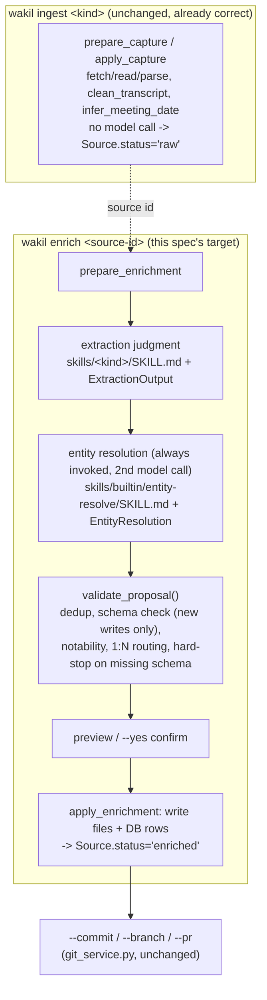

# Ingestion, Entity Resolution & Metadata — Refactor Spec

Four documents in this directory now cover adjacent pieces of the same
problem, written from different angles and at different times. This spec is
the fifth: it doesn't re-derive any of their content, it says how they
compose into one implementation plan, fills the one genuine gap between them
(a content migration path for the existing vault), and sequences the work.

| Doc | Covers | This spec's relationship to it |
| --- | --- | --- |
| `ingestion-model.md` | Why: the pipeline-shape philosophy (classify/extract/resolve/enforce/finalize as separable concerns, fixed-topology DAG, skill files as judgment content) | Architecture section below implements its proposal directly |
| `entity-model.md` | Compiled Truth / Timeline data model, `Memory`/`Relationship` extensions, `wakil entity compile` command, entity auto-stubbing | Its data-model additions (minus `entity compile`, deferred) are in scope here |
| `entity-resolution.md` | Routing constraints, from a critical read of the target vault's `RESOLVER.md` | Its three constraints (no first-match-wins, 1:N routing, hard-stop on missing schema) are implemented in `validate_proposal()` below |
| `entity-metadata.md` | The actual per-type frontmatter schema, from a census of the real vault | Its ~14 corrected schema blocks become `schema/entities/*.yaml`; its migration recommendations become the migration tool below |

## Scope

**Already shipped, assumed as the foundation below:** `ingest_service.py`
no longer has a single `prepare_ingest`/`apply_ingest` pair. It was split
into two commands, one deterministic and one model-driven: `wakil ingest`
(`prepare_capture`/`apply_capture` — extract, dedupe, write the raw source
under `sources/`, no model call, `Source.status="raw"`) and `wakil enrich
<source-id>` (`prepare_enrichment`/`apply_enrichment` — model analysis of an
already-captured source, run separately and re-runnable via `--force`,
`Source.status="enriched"`). That split also shipped a `context` CLI option,
deterministic `clean_transcript()`, `infer_meeting_date()`, and SCHEMA.md/
RESOLVER.md-aware guidance folded into the enrichment prompt
(`load_workspace_guides`). This spec builds inside that shape rather than
against it — see the Architecture section for how the DAG maps onto it.

**In scope:** restructuring `prepare_enrichment`/`apply_enrichment` into the
fixed DAG `ingestion-model.md` proposes (capture stays as-is — it's already
the correctly-scoped mechanical step); a data-driven, code-validated entity
schema layer; splitting entity resolution out as its own always-invoked
step within enrichment; a migration tool that brings the existing vault's
~2,500 files into conformance with the corrected schema (not indefinite
tolerance); the DB schema changes `entity-model.md` specifies.

**Explicitly deferred**, each for a reason already settled in prior
discussion, not because it's out of scope forever:

- `wakil entity compile <slug>` (Compiled Truth synthesis) — depends on
  memory promotion, which isn't built yet (Phase 5). Design it once that
  lands, against whichever memory-state vocabulary is authoritative then.
- Memory-state vocabulary reconciliation (`memory-model.md`'s proposed
  `candidate/active/dormant/archived` + `strength/activation` vs. the
  implemented `working/candidate/durable/archived/rejected`) — this
  refactor builds against the **implemented** vocabulary. `memory-model.md`
  stays a distinct, not-yet-built enhancement layer.
- Provider-native structured output (Anthropic tool-use / OpenAI
  `response_format`) — Pydantic validate + one retry is the v1 contract
  mechanism; revisit only if the retry rate in practice turns out high.
- Workspace-runtime plugin/extension loading — new entity types and ingest
  kinds are added by forking and editing wakil's own source tree, not
  discovered at runtime from a workspace directory.

## Architecture



Classification (the `kind` recorded at capture, e.g. `transcript`/`article`/
`text`) isn't a DAG node — it's read from the `Source` row and used to pick
which `skills/<kind>/SKILL.md` file to load. Capture already correctly
isolates the mechanical, kind-specific concern (SRT stripping, transcript
cleanup, date inference) with no model call and needs no further
restructuring. Everything from `prepare_enrichment` onward is fixed
topology, sequenced by code, never agent-decided — and note this is now
**two model calls, not one**: judgment-extraction and entity-resolution are
separate calls within the same `prepare_enrichment` invocation, still one
preview, still gated on one confirm. That's consistent with keeping
orchestration in code you can read top to bottom, as opposed to an agent
deciding whether to make a second call.

## New components

### 1. Entity schema layer

`src/wakil/schema/entities/*.yaml`, shipped as part of the wakil package
(forked and edited to match whichever target vault this checkout points
at — per the earlier decision that extension happens by forking, not by
runtime discovery). One file per type, transcribing `entity-metadata.md`'s
already-corrected per-type blocks. Worked example for the shape (the
remaining ~13 types — `company`, `project`, `concept`, `meeting`, `journal`,
`assessment`, `reflection`, `idea`, `organization`, the two `learning-agenda`
variants, `meta`, `index`, plus per-origin `source` sub-schemas — transcribe
the same way):

```yaml
# schema/entities/person.yaml
type: person
directory: people
category: identity        # identity | document | hybrid — entity-metadata.md's 3-way split
fields:
  name: {required: true, kind: string}
  aliases: {required: false, kind: list}
  company: {required: false, kind: ref, ref_type: company}
  role: {required: false, kind: string}
  status: {required: true, kind: enum, values: [active, former, candidate, prospect, contact]}
  relationship: {required: false, kind: enum, values: [coworker, report, manager, candidate, recruiter, vendor, mentor]}
  linkedin: {required: false, kind: string}
  github: {required: false, kind: string}
  email: {required: false, kind: string}
  end-date: {required: false, kind: date}
  tags: {required: false, kind: list}
  created: {required: true, kind: date}
  updated: {required: true, kind: date}
```

New code: `src/wakil/schema/loader.py` (parse the directory into
`EntitySchema` Pydantic models, cached per workspace) and
`src/wakil/schema/validate.py` (`validate_frontmatter(entity_type, frontmatter)
-> list[SchemaError]`, empty = valid). Applies to **new writes only** —
reading/indexing existing files keeps using `Note.frontmatter_json` exactly
as tolerantly as it does today.

### 2. Database schema changes + Alembic

`TODO.md` already flags "Alembic migrations once the schema starts
evolving" as pending; this refactor is that trigger. Two genuinely new
columns, both from `entity-model.md`:

- `Memory.event_date: date | None` — Timeline ordering needs the event's
  own date, not `created_at` (when the SQLite row was written).
- `Relationship.subject_note_id: int | None`, `object_note_id: int | None`
  — today's `Relationship` only models Memory↔Memory edges; wikilinks are
  Note↔Note structural edges, a different thing.

Set up Alembic for the first time: `alembic.ini`, `migrations/` with a
baseline migration capturing the current `create_all` state, then a second
migration adding the two columns above. This is infrastructure wakil hasn't
needed until now — call it out as its own step, not folded silently into
the ingest-pipeline work.

### 3. Enrichment pipeline restructuring

Everything below targets `prepare_enrichment`/`apply_enrichment` and the
`EnrichmentProposal`/`EnrichmentResult` dataclasses. `prepare_capture`/
`apply_capture`/`CaptureProposal`/`CaptureResult` are untouched — capture
already is the correctly-scoped mechanical step.

- `src/wakil/skills/builtin/{transcript,text,article}/SKILL.md` — the judgment
  content currently embedded in `INGEST_SYSTEM_PROMPT` (`llm/prompts.py`),
  rewritten as prose per `source.source_type`, with the JSON-shape block
  removed (it moves to code, generated from a Pydantic model, so it can
  never drift out of sync with the validator the way today's
  prompt-vs-`parse_ingest_response` duplication can). Capture already
  absorbed the mechanical kind-specific work, so these files carry
  judgment only — e.g. a transcript's "find the resolution, don't anchor on
  the first option" vs. an article's "quotable lines, not paraphrase."
- `src/wakil/skills/builtin/entity-resolve/SKILL.md` — new judgment content, not a
  rewrite of anything existing: how to decide create/update/skip for a
  mentioned entity, the notability heuristic, how to propose a frontmatter
  patch for an update vs. a full stub for a create.
- `src/wakil/llm/schemas.py` — `ExtractionOutput` (title, summary,
  key_points, memories, relationships, proposed_note — the shape
  `INGEST_SYSTEM_PROMPT` already describes in prose, now a Pydantic model)
  and `EntityResolution` (name, entity_type, action:
  `Literal["create","update","skip"]`, target_note_path, confidence,
  proposed_frontmatter).
- `src/wakil/llm/skill_loader.py` — reads a `SKILL.md`'s frontmatter +
  prose body, and a prompt builder that injects `Model.model_json_schema()`
  for the relevant contract, so the schema shown to the model and the
  schema validated against are always the same object.
- Replace `parse_ingest_response`'s defensive dict-coercion with
  `validate_model_response(raw, schema) -> BaseModel`: strip code fences
  (kept), `Schema.model_validate_json`, catch `ValidationError`, retry once
  with the error appended to the prompt, and on a second failure mark that
  call's result as visibly failed in the proposal (never silently coerce to
  an empty shape — today's behavior on malformed output, and a real gap
  independent of anything else in this spec). Both calls in
  `prepare_enrichment` (extraction, then entity resolution) use this.
- `EnrichmentProposal` gains `stub_entities: list[ProposedFile]` (per
  `entity-model.md`) and `entity_resolutions: list[EntityResolution]` so the
  preview can render what the resolution step decided, not just the final
  file list.
- New `validate_proposal(proposal) -> list[ValidationError]` between
  `prepare_enrichment` and `apply_enrichment`, implementing
  `entity-resolution.md`'s three constraints plus the schema check:
  content-hash dedup (already handled at capture time via `content_hash` on
  `Source` — not re-added here, just noted as already covered upstream),
  `schema/entities/*.yaml` validation on every proposed new file, a
  notability check surfaced from `EntityResolution.action`, 1:N routing (one
  proposal, many target files — already `EnrichmentProposal`'s shape via
  `proposed_note` + `stub_entities`, just now enforced rather than assumed),
  and a hard stop (not a best-guess write) when a proposed `type:` has no
  matching schema file.

### 4. Migration tool for existing vault content

New, not covered by any prior doc — `entity-metadata.md` and
`entity-resolution.md` both flag specific migrations but neither specs the
tool that performs them, and per your last answer, existing files need an
actual migration path rather than indefinite tolerance.

`wakil schema migrate [--type <type>] [--dry-run] [--yes]`: walks indexed
notes, loads the matching `schema/entities/<type>.yaml`, diffs current
frontmatter against it, and proposes fixes — same propose→diff→confirm
discipline as ingest, batched per type (one summary confirmation per type,
individual diffs available on request, mirroring `entity-model.md`'s
stub-entity confirmation pattern). Two tiers, sequenced separately because
the source docs already recommend that sequencing:

- **Cheap tier** (do first): casing/naming duplicate normalization
  (`end-date`/`end_date`, `author`/`authors`, `url`/`link`, quoted vs.
  unquoted `type: source`), retype `organization/*.md` files that declare
  `type: concept` to `type: organization`, correct naive title-caser
  artifacts on the `name`/`title` pair.
- **Expensive tier** (sequence later, flagged as bigger by the source docs
  themselves): retype `learning-agenda` leaves to `concept` + `curriculum:`
  and add container files per curriculum; move
  `wiki/personal/reflections/**` to `ideas/reflections/**` with inbound
  wikilink rewrite.

Default to `--dry-run`, git-native commit per type on confirm (matching
existing `git_service.py` conventions), never silent.

## Phasing

```
A. Entity schema layer (schema/entities/*.yaml + loader/validator)
B. Alembic + DB columns                      \  can run in parallel once A lands
C. Ingest pipeline restructuring (DAG)        /  C depends on A (validation) and B (event_date, subject/object_note_id)
D. Migration tool, cheap tier                  -- depends on A only; can start alongside B/C
D'. Migration tool, expensive tier             -- sequence last, per the source docs' own advice
```

Recommended order: **A → {B, D-cheap in parallel} → C → D'-expensive**.
Nothing in C blocks D, and nothing in D blocks C except sharing the schema
layer from A.

## Testing strategy

- Extend `tests/unit/test_ingest_service.py`: mock `ModelClient` to return
  fixed JSON matching `ExtractionOutput`/`EntityResolution` for the two
  calls inside `prepare_enrichment`; add explicit coverage for the
  validate→retry→visible-failure path on malformed output, which today's
  `parse_ingest_response` fallback has no visible test for. `prepare_capture`/
  `apply_capture` tests are unaffected — no change needed there.
- New `tests/unit/test_schema_loader.py` — YAML parsing, required/forbidden
  field checks, enum validation.
- New `tests/unit/test_entity_resolution.py` — the resolution node's
  create/update/skip decisions against fixture existing notes.
- New `tests/unit/test_schema_migrate.py` — dry-run diff generation against
  one fixture file per cheap-tier fix type.
- Extend `tests/integration/test_ingest_cli.py`'s `wakil enrich` coverage
  for the new preview shape (`stub_entities`, entity resolutions shown
  before confirm).

## Critical files

- `src/wakil/schema/entities/*.yaml`, `src/wakil/schema/loader.py`,
  `src/wakil/schema/validate.py` — new
- `src/wakil/storage/schema.py` — `Memory.event_date`,
  `Relationship.subject_note_id`/`object_note_id`
- `alembic.ini`, `migrations/` — new
- `src/wakil/skills/builtin/{transcript,text,article,entity-resolve}/SKILL.md` — new
- `src/wakil/llm/schemas.py`, `src/wakil/llm/skill_loader.py` — new
- `src/wakil/llm/prompts.py` — `INGEST_SYSTEM_PROMPT`/`parse_ingest_response`
  retired in favor of the above
- `src/wakil/app/ingest_service.py` — `prepare_enrichment`/`apply_enrichment`
  split into DAG steps, `EnrichmentProposal.stub_entities`/
  `entity_resolutions`, new `validate_proposal()`. `prepare_capture`/
  `apply_capture` untouched.
- `src/wakil/app/schema_migrate_service.py` (or similar) — new, the
  migration tool's logic
- `src/wakil/cli/main.py` — new `wakil schema migrate` command
